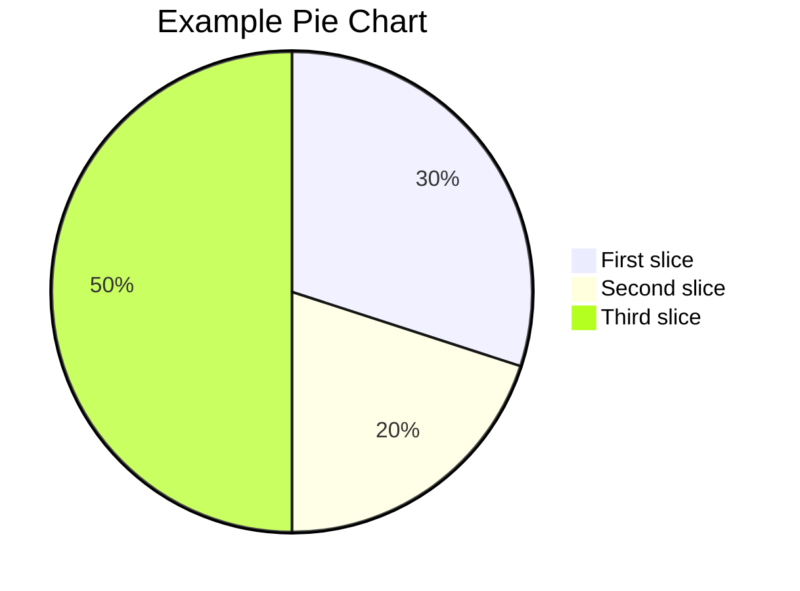

### video



### images

{: w="600" h="400" }
_tree_
{: w="600" h="400"}
{: w="600" h="400"}
{: w="600" h="400"}
{: w="600" h="400"}


### code display

`printf("hello world");`

```c
int main()
{
   printf("hello world"); 
}
```
```c
int main()
{
   printf("hello world"); 
}
```
{: .nolineno }

```yaml
key: value
```

### Filepath Hightlight
`/path/to/a/file.extend`{: .filepath}


### Specifying the Filename for code Block
```shell
pwd
make all
```
{: file="~/path" }


### 任务列表
- [x] get up at 6:00
- [ ] have a breakfast
- [ ] finish homework


### 定义说明
字节
: 可寻址的最小内存块

### 下划线 
~~下划线~~


### Mathematics

<!-- Block math, keep all blank lines -->

$$
\frac{n!}{k!(n-k)!} = \binom{n}{k}
$$

<!-- Inline math in lines, NO blank lines -->

取模运算 $$ x \equiv a \pmod{b} $$ 

<!-- Inline math in lists, escape the first `$` -->

1. \$$ \cos (2\theta) = \cos^2 \theta - \sin^2 \theta $$ 
2. \$$ \sqrt{\frac{a}{b}} $$
3. \$$ \sqrt[n]{1+x+x^2+x^3+\dots+x^n} $$


### Mermaid


### Prompts

> a small tip.
{: .prompt-tip }

> infomation for this page.
{: .prompt-info }

> some warnings exists
{: .prompt-warning}

> in dangers
{: .prompt-danger}

### Liquid Codes


```liquid

  This product's title contains the word Pack.

```
s