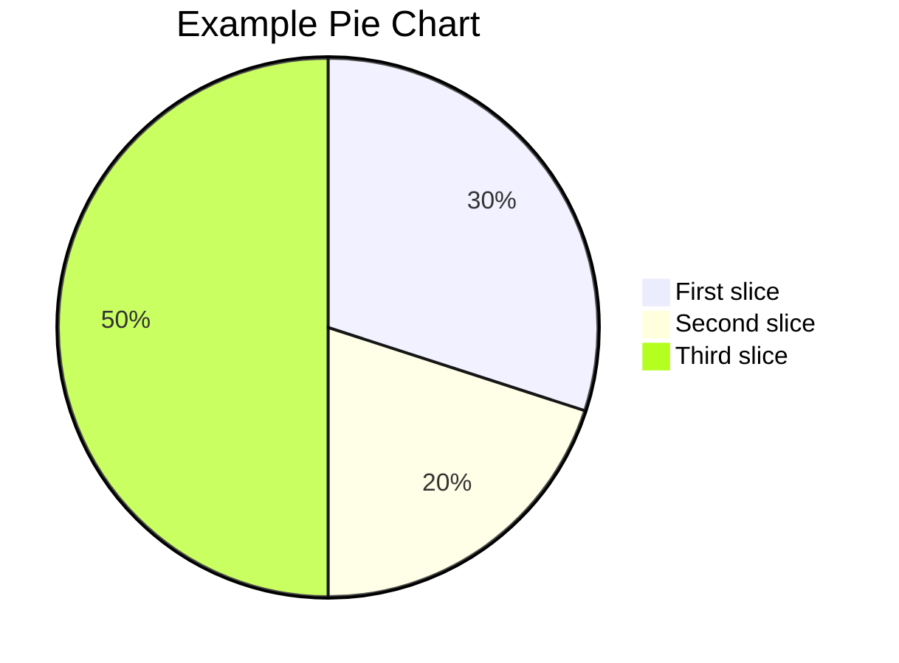

this is a template for technical markdown file

we could write markdown file according to the template


## images
{: w="600" h="400" }
_tree_
{: w="600" h="400"}


## code display

### inline code
`printf("hello world");`

### code block
```c
int main()
{
   printf("hello world"); 
}
```
### code block without line number
```c
int main()
{
   printf("hello world"); 
}
```
{: .nolineno }

### specify language
```yaml
key: value
```

### Filepath Hightlight
`/path/to/a/file.extend`{: .filepath}


### Specifying the Filename for code Block
```shell
pwd
make all
```
{: file="~/path" }


## 任务列表
- [x] get up at 6:00
- [ ] have a breakfast
- [ ] finish homework

## 表格

| 指针 | 引用 | 
| :-----:| :----: | 
| 指针是实体 | 不是实体只是别名| 
| 单元格 | 单元格 | 

## 定义说明
字节
: 可寻址的最小内存块

## 下划线 
~~下划线~~


## Mathematics


<!-- Block math should be added with $$ math $$ with mandatory blank lines before and after $$ -->
### block math

$$
\frac{n!}{k!(n-k)!} = \binom{n}{k}
$$

<!-- Inline math (in lines) should be added with $$ math $$ without any blank line before or after $$ -->
### Inline math(in lines)
取模运算$$ x \equiv a \pmod{b} $$

<!-- Inline math (in lists) should be added with \$$ math $$ -->
### Inline math(in lists)
1. \$$ \cos (2\theta) = \cos^2 \theta - \sin^2 \theta $$
2. \$$ \sqrt{\frac{a}{b}} $$
3. \$$ \sqrt[n]{1+x+x^2+x^3+\dots+x^n} $$


## Mermaid


## Prompts

> a small tip.
{: .prompt-tip }

> infomation for this page.
{: .prompt-info }

> some warnings exists
{: .prompt-warning}

> in dangers
{: .prompt-danger}

## Liquid Codes


```liquid

  This product's title contains the word Pack.

```

