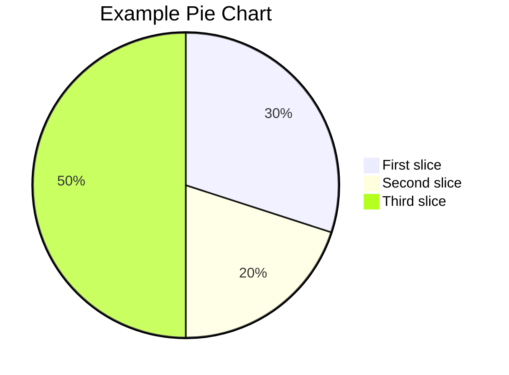

# technical blog write template
this is a template for technical markdown file
we could write markdown file according to the template

------

## images
{: w="600" h="400" }
_tree_
{: w="600" h="400"}

------

## code display

### inline code
`printf("hello world");`

### code block
```c
int main()
{
   printf("hello world"); 
}
```
### code block without line number
```c
int main()
{
   printf("hello world"); 
}
```
{: .nolineno }
### specify code language
```bash
if [ $? -ne 0 ]; then
  echo "The command was not successful.";
  #do the needful / exit
fi;
```
------

## file display

### specify filetype
```yaml
key: value
```
### Specifying the Filename
```
# content
```
{: file="1.txt" }

--------

## command-line display
### console
```console
root@iZbp19rh4d6jcag5epp4hrZ:~# ls -al
total 56332
-rw-r--r--  1 root root     2266 Oct 27 19:52 1.txt
-rw-r--r--  1 root root     2315 Oct 27 19:57 2.txt
-rw-r--r--  1 root root     2364 Oct 27 19:58 3.txt
-rw-r--r--  1 root root     2413 Oct 27 19:58 4.txt
```
### terminal
```terminal
root@iZbp19rh4d6jcag5epp4hrZ:~# ls -al
total 56332
drwx------ 29 root root     4096 Nov 10 09:00 .
drwxr-xr-x 19 root root     4096 Apr 10  2024 ..
-rw-r--r--  1 root root     2266 Oct 27 19:52 1.txt
-rw-r--r--  1 root root     2315 Oct 27 19:57 2.txt
```
### plaintext
```plaintext
By default, all languages except plaintext, console, and terminal will display line numbers. When you want to hide the line number of a code block, add the class nolineno to it
```

--------
## 列表
### 任务列表
- [x] get up at 6:00
- [ ] have a breakfast
- [ ] finish homework

### 有序列表
1. 颜值超
2. 方世玉
3. 李佳欣

### 无序列表 
* yzc
* qhx
* ljy
- 问题1
- 问题2
- 问题3

---------

## 表格

| 指针 | 引用 | 
| :-----:| :----: | 
| 指针是实体 | 不是实体只是别名| 
| 单元格 | 单元格 | 


---------

## 格式

### 超链接
[跳转到此文](http://127.0.0.1:4000)

### 跳转链接
<https://markdown.com.cn>

<fake@example.com>

### 定义说明
字节
: 可寻址的最小内存块

### 下划线 
~~下划线~~

### 加粗
**I love you**
### 加斜
*I love you*
### 加粗加斜
***I love you***

### 块引用
> This line shows the _block quote_.

### 文件路径高亮
`/path/to/a/file.extend`{: .filepath}


-------

## Mathematics


<!-- Block math should be added with $$ math $$ with mandatory blank lines before and after $$ -->
### block math

$$
\frac{n!}{k!(n-k)!} = \binom{n}{k}
$$

<!-- Inline math (in lines) should be added with $$ math $$ without any blank line before or after $$ -->
### Inline math(in lines)
取模运算$$ x \equiv a \pmod{b} $$

<!-- Inline math (in lists) should be added with \$$ math $$ -->
### Inline math(in lists)
1. \$$ \cos (2\theta) = \cos^2 \theta - \sin^2 \theta $$
2. \$$ \sqrt{\frac{a}{b}} $$
3. \$$ \sqrt[n]{1+x+x^2+x^3+\dots+x^n} $$


## Mermaid


--------

## Prompts

> a small tip.
{: .prompt-tip }

> infomation for this page.
{: .prompt-info }

> some warnings exists
{: .prompt-warning}

> in dangers
{: .prompt-danger}

