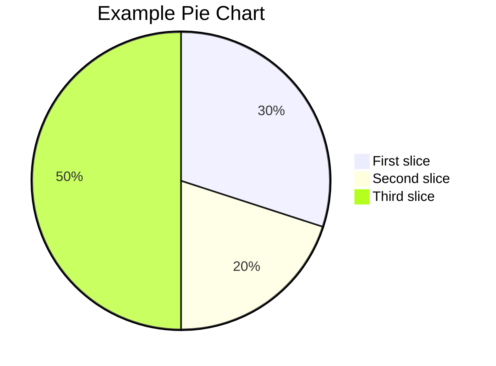

---

title: markdown post 
date: 2023-11-18 19:23:00 +0800
categories: [default]
tags: [test]     
author: 111

# Table of Contents (TOC) is displayed on the right panel of the post
toc: true 

# close the comment for a specific post
comments: false 

# loaded mathematical feature
math: true 

# enable mermaid(a great diagram generation tool) on your post
mermaid: true  

img_path: /img/path/

#  add an image at the top of the post, please provide an image with a resolution of 1200 x 630
image:
  path: /path/to/image
  alt: image alternative text

# pin one or more posts to the top of the home page
pin: true

---


<!-- Block math, keep all blank lines -->

$$
\cos (2\theta) = \cos^2 \theta - \sin^2 \theta
$$

<!-- Inline math in lines, NO blank lines -->

"Lorem ipsum dolor sit amet, $$ x \equiv a \pmod{b} $$ consectetur adipiscing elit."

<!-- Inline math in lists, escape the first `$` -->

1. \$$ f(n) = n^5 + 4n^2 + 2 |_{n=17} $$
2. \$$ \sqrt{\frac{a}{b}} $$
3. \$$ \sqrt[n]{1+x+x^2+x^3+\dots+x^n} $$




{: w="700" h="400" }
_Image Caption_

{: .normal }

{: .left }

{: .right }


`printf("hello world");`

```c
int main()
{
   printf("hello world"); 
}
```


`/path/to/a/file.extend`{: .filepath}

```shell
echo 'No more line numbers!'
```
{: .nolineno }

```shell
# content
```
{: file="path/to/file" }